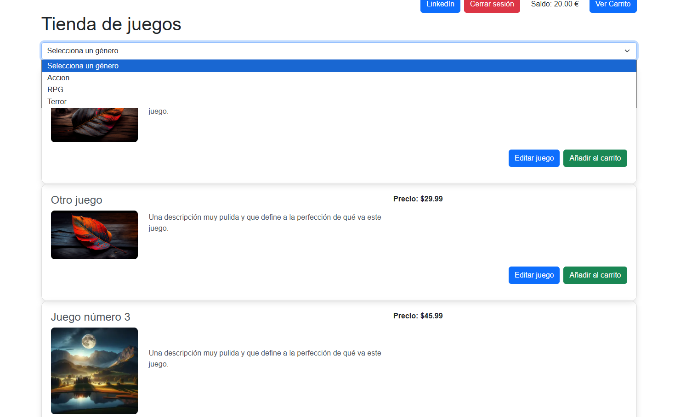
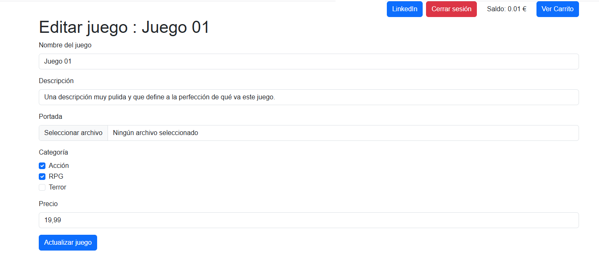

<h2> LINK DE PRODUCCIÓN: </h2>
https://laravel-tienda-juegos-production.up.railway.app/
(No funciona el enlace porque expiró el periodo de alojamiento gratuito)

# Vista previa del proyecto

El proyecto se centra en la funcionalidad, más que en el diseño. Se trata de un CRUD de videojuegos.
- Utilización de sesiones y carritos para los pedidos.
- No puedes adquirir productos si tu saldo es inferior al coste total del carrito.
- Se añade al selector de géneros de los videojuegos en función de si en la creación de un juego se ha escrito uno nuevo.
- Los usuarios pueden ser administradores o usuarios normales.

### Listado de juegos

---

### Carrito de compra

---

### Crear juego

---

### Editar juego
